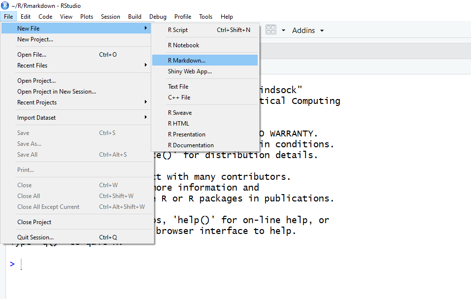
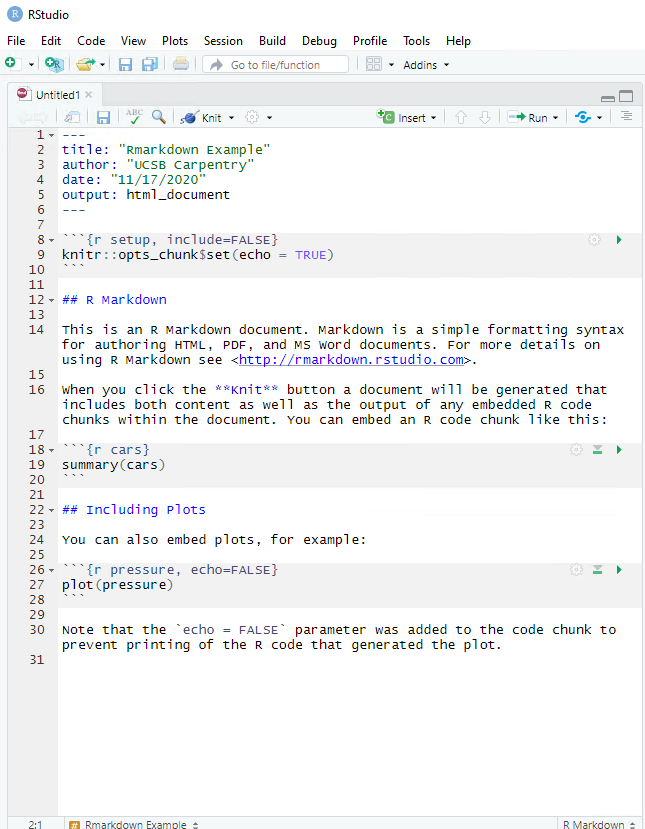
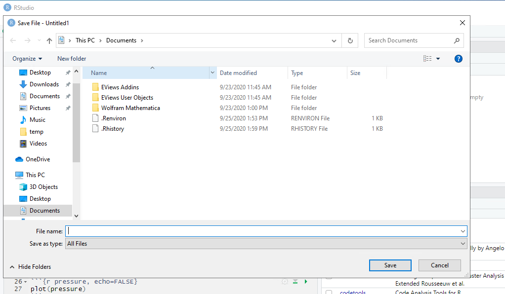
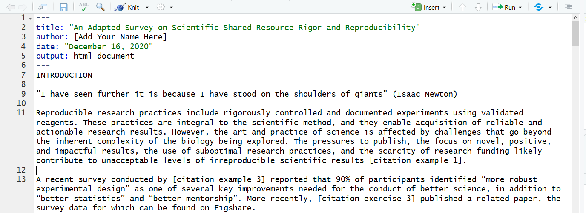

## Getting Around RStudio

Throughout this lesson, we're going to teach you some of the fundamentals of using R Markdown as part of your RStudio workflow.

We'll be using RStudio: a free, open source R Integrated Development
Environment (IDE). It provides a built in editor, works on all platforms (including
on servers) and provides many advantages such as integration with version
control and project management.

This lesson assumes you already have a basic understanding of R and RStudio but we will do a brief tour of the IDE, review R projects and the best practices for organizing your work, and how to install packages you may want to use to work with R Markdown.


**Basic layout**

When you first open RStudio, you will be greeted by three panels:

  * The interactive R console/Terminal (entire left)
  * Environment/History/Connections (tabbed in upper right)
  * Files/Plots/Packages/Help/Viewer (tabbed in lower right)


Once you open files, such as .Rmd files or .R files, an editor panel will also open
in the top left.


### Working in an R Project

The scientific process is naturally incremental, and many projects
start life as random notes, some code, then a manuscript, and
eventually everything is a bit mixed together.

<blockquote class="twitter-tweet"><p>Managing your projects in a reproducible fashion doesn't just make your science reproducible, it makes your life easier.</p>— Vince Buffalo (@vsbuffalo) <a href="https://twitter.com/vsbuffalo/status/323638476153167872">April 15, 2013</a></blockquote>
<script async src="//platform.twitter.com/widgets.js" charset="utf-8"></script>

Most people tend not to think about how to organize their files which may result in something like this:


There are many reasons why we should *ALWAYS* avoid this:

1. It is really hard to tell which version of your data is
the original and which is the modified;
2. It gets really messy because it mixes files with various
extensions together;
3. It probably takes you a lot of time to actually find
things, and relate the correct figures to the exact code
that has been used to generate it;

A good project layout will ultimately make your life easier:

* It will help ensure the integrity of your data;
* It makes it simpler to share your code with someone else
(a lab-mate, collaborator, or supervisor);
* It allows you to easily upload your code with your manuscript submission;
* It makes it easier to pick the project back up after a break.

#### A possible solution

Fortunately, there are tools and packages which can help you manage your work effectively.

One of the most powerful and useful aspects of RStudio is its project management
functionality. We'll be using an R project today to compliment our Rmarkdown document and bundle all the files needed for our paper into a self-contained, reproducible
project. After opening the project we'll review good ways to organize your work. 

The simplest way to open an RStudio project once it has been created is to click
through your file system to get to the directory where it was saved and double
click on the `.Rproj` file. This will open RStudio and start your R session in the
same directory as the `.Rproj` file. All your data, plots and scripts will now be
relative to the project directory. RStudio projects have the added benefit of
allowing you to open multiple projects at the same time each open to its own
project directory. This allows you to keep multiple projects open without them
interfering with each other.

> ## CHALLENGE 2.1  
> Open an RStudio project through the file system
>
> 1. Exit RStudio.
> 2. Navigate to the directory where you downloaded & unzipped the zip folder for this workshop
> 3. Double click on the `.Rproj` file in that directory.
> 
>> ## SOLUTION
>> FIXME add screen shot of proj file with folders in zip
> {: .solution}
{: .challenge}

#### Best practices for project organization

Although there is no "best" way to lay out a project, there are some general
principles to adhere to that will make project management easier:

##### Treat data as read only

This is probably the most important goal of setting up a project. Data is
typically time consuming and/or expensive to collect. Working with them
interactively (e.g., in Excel) where they can be modified means you are never
sure of where the data came from, or how it has been modified since collection.
It is therefore a good idea to treat your data as "read-only".

##### Data Cleaning

In many cases your data will be "dirty": it will need significant preprocessing
to get into a format R (or any other programming language) will find useful.
This task is sometimes called "data munging". Storing these scripts in a
separate folder, and creating a second "read-only" data folder to hold the
"cleaned" data sets can prevent confusion between the two sets.

##### Treat generated output as disposable

Anything generated by your scripts should be treated as disposable: it should
all be able to be regenerated from your scripts.

There are lots of different ways to manage this output. Having an output folder
with different sub-directories for each separate analysis makes it easier later.
Since many analyses are exploratory and don't end up being used in the final
project, and some of the analyses get shared between projects.

##### Where R Markdown Files come into play

FIXME add this

> ## Tip: Good Enough Practices for Scientific Computing
>
> [Good Enough Practices for Scientific Computing](https://github.com/swcarpentry/good-enough-practices-in-scientific-computing/blob/gh-pages/good-enough-practices-for-scientific-computing.pdf) gives the following recommendations for project organization:
>
> 1. Put each project in its own directory, which is named after the project.
> 2. Put text documents associated with the project in the `doc` directory.
> 3. Put raw data and metadata in the `data` directory, and files generated during cleanup and analysis in a `results` directory.
> 4. Put source for the project's scripts and programs in the `src` directory, and programs brought in from elsewhere or compiled locally in the `bin` directory.
> 5. Name all files to reflect their content or function.
>
{: .callout}

For this project, we used the following setup for folders and files:  
FIXME make sure this is accurate after finishing the .proj file  
**bin:** contains a a .csl file for changing the bibliography to APA format from the default Rstudio Chicago style  
**code:** a different name for the `src` folder. This will contain our data cleaning scripts, R scripts for plots and Rmarkdown scripts for writing our paper  
**data:** this folder contains our raw data files. We downloaded both an .xlxs and .txt  
**docs:** This contains our raw text file for the paper and our .bibtex for bibliography as well as any other notes we may have about the project.   
**figs:** This is for the .png figures we found and wanted to add into our paper. It can also be used to save .png or .jpeg copies of the figures we output from our code.  
**results:** This is where the rendered version of our .Rmd (and .R) file will save to.  
**RMarkdown_Workshop.Rproj** lives in the root directory.    
**README.md** A detailed project description with all collaborators listed.   
**CITATION.txt** Directions to cite the project.  
**LICENSE.txt** Instructions on how the project or any components can be reused.   

Again, there are no hard and fast rules here, but remember, it is important at least to keep your raw data files separate and to make sure they don't get overidden after you use a script to clean your data. It's also very helpful to keep the different files generated by your analysis organized in a folder.

#### Version Control

It is important to use version control with projects.  Go [here for a good lesson which describes using Git with RStudio](https://swcarpentry.github.io/git-novice/14-supplemental-rstudio/).


### R Packages

It is possible to add functions to R by writing a package, or by
obtaining a package written by someone else. As of this writing, there
are over 10,000 packages available on CRAN (the comprehensive R archive
network). R and RStudio have functionality for managing packages:

* You can see what packages are installed by typing
  `installed.packages()`
* You can install packages by typing `install.packages("packagename")`,
  where `packagename` is the package name, in quotes.
* You can update installed packages by typing `update.packages()`
* You can remove a package with `remove.packages("packagename")`
* You can make a package available for use with `library(packagename)`

Packages can also be viewed, loaded, and detached in the Packages tab of the lower right panel in RStudio. Clicking on this tab will display all of installed packages with a checkbox next to them. If the box next to a package name is checked, the package is loaded and if it is empty, the package is not loaded. Click an empty box to load that package and click a checked box to detach that package. 

Packages can be installed and updated from the Package tab with the Install and Update buttons at the top of the tab. 

FIXME: change Challenge  packages 

> ## CHALLENGE 2.2
>
> Install the following packages: `bookdown`, `tidyverse`, `kable`
>
> > ## SOLUTION
> >
> > We can use the `install.packages()` command to install the required packages.
> > 
> > ~~~
> > install.packages("bookdown")
> > install.packages("tidyverse")
> > install.packages("kable")
> > ~~~
> > {: .language-r}
> >
> > An alternate solution, to install multiple packages with a single `install.packages()` command is:
> > 
> > ~~~
> > install.packages(c("bookdown", "tidyverse", "kable"))
> > ~~~
> > {: .language-r}
> {: .solution}
{: .challenge}

## Starting a R Markdown File 

Start a new R markdown document in RStudio by clicking File > New File > R Markdown…



If this is the first time you have ever opened an R markdown file a dialog box will open up to tell you what packages need to be installed. 


Click "Yes". The packages will take a few seconds to install. You should see that this was successful.


Once the package installs have completed, a dialog box will pop up and ask you to name the file and add an author name (may already know what your name is) The default output is HTML and as the wizard indicates, it is the best way to start and in your final version or later versions you have the option of changing to pdf or word document (among many other output formats! We'll see this later). 


New R Markdown will always pop up with a generic template…

If you see this template you're good to go.


Now we’ll get into how the Rmarkdown file is organized and then on to editing and styling!

## R Markdown Workflow
 
R Markdown has four distinct steps in the workflow:
1. create a **YAML header** (optional)
2. write **text** formatted with R Markdown 
3. add R **code chunks** for embedded analysis
4. render the document with **Knitr**


 
Let’s dig in to those more:

### YAML header: 
#### What is YAML anyway? 
YAML, pronounced "Yeah-mul" stands for "YAML Ain't Markup Language". YAML is a human-readable [data-serialization](https://en.wikipedia.org/wiki/Serialization) language>.  YAML has no executable commands though it is compatible with all programming languages or basically any application that deals with storing or transmiting data. YAML itself is made up of bits of many languages including Perl, MIME, C, & HTML. YAML is a superset of JSON. When used as a stand-alone file the file ending is .yml. 
<br>

R Markdown's default YAML header includes the following metadata surrounded by ---s:
* title  
* author  
* date  
* output  

FIXME add basic yaml screenshot  

The first three are self-explanatory, but what's the output? We saw this in the wizard for starting a new document, by default you are able to pick from pdf, html, and word document. Basically this exports your rmd file as a file type of your choice.  
<br> 

We’ll see other formatting options for YAML later on including how to add bibliography information, customize our output, and change the default settings of the knit function. Below is an example of how our YAML file will look at the end of this workshop.

```
---
title: "An Adapted Survey on Scientific Shared Resource Rigor and Reproducibility"
author: UCSB Carpentry
date: "December 15, 2020"
output:
  html_document:
    number_sections: true
bibliography: ../docs/bibliography.bibtex
csl: ../bin/apa-5th-edition.csl
knit: (function(inputFile, encoding) { 
      out_dir <- '../results';
      rmarkdown::render(inputFile,
                        encoding=encoding, 
                        output_file=file.path(dirname(inputFile), out_dir, 'Paper_Template_html.html')) })
---
```


### Formatted text: 
- Text mixed with simple text formatting
Formatted text is one of the benefits added above and beyond the capabilities of a regular r script. Notice you don’t need to encase the text in any symbols as you do code chunks. Any symbols you do see that aren’t regular grammar components are for formatting, such as ##, ** **, and < >.

FIXME add screen shot text chunk


> ## CHALLENGE 2.3 (optional)
> Can you deduce what each of the three types of symbols (`##`, `**`, `<>`) do for formatting?
>```
>## R Markdown
>
>This is an R Markdown document. Markdown is a simple formatting syntax for authoring HTML, PDF, and MS Word documents. For more details on using R Markdown see <http://rmarkdown.rstudio.com>.
>
>When you click the **Knit** button a document will be generated that includes both content as well as the >output of any embedded R code chunks within the document. You can embed an R code chunk like this:
>```
>
>> ## SOLUTION
>> `##` is a heading, `**` is to bold enclosed text, and `<>` is for hyperlinks. 
>> Don't worry about this too much right now! This is an example of R markdown syntax for styling, we'll dive into this next.
>{: .solution}
{: .challenge}

### Code Chunks: 
- R code chunks surrounded by \```s
- Highlighted in gray
This is the section you add R code, if you’ve already written an R script you can copy and paste your code between the \``` ``` lines to output whichever pieces you want at that particular spot in the document

[FIXME insert screenshot of code chunks]

#### Knitting
This is called Knitting and the button looks like a spool of yarn with a knitting needle. Clicking the knit button will output the type of file indicated in your yaml header. In our case it’s html but the other options we saw were word and pdf. One nice thing about the knit button is that it saves the .Rmd document each time you run it.
[FIXME insert spool icon]

FIRST we’re going to pause and see what the Rmarkdown does when it’s rendered into the final html document the output is set as in the yaml - knitting periodically while we're working allows us to catch errors early. 

This is a little preview of what's to come in the Knitr syntax episodes later on.


How the document looks when you knit with echo=TRUE:


> ## CHALLENGE 2.4 (optional)
> Can you deduce what the echo=TRUE option stand for?
{: .challenge}

### Starting our paper
Ok, now let’s start on our own rmd document.   

Do this on your own in your new rmd file:  

1) Delete EVERYTHING except the yaml header   

2) Edit the yaml header to add the `title` of the paper we're working on and to add yourself as `author`. 

~~~
---
title: "An Adapted Survey on Scientific Shared Resource Rigor and Reproducibility"
author: [Add Your Name Here]
date: "December 16, 2020"
output: html_document
---
~~~
{: .source}

3) Navigate to the `docs` folder and open `rawtext.txt FIXME`. Copy all the text with either `ctrl-a` or `cmd-a` and paste AFTER the yaml header in our rmd file.
~~~
...
output:
  html_document
---
An Adapted Survey on Scientific Shared Resource Rigor and Reproducibility
1 INTRODUCTION
Reproducible research practices include rigorously controlled and documented experiments using validated reagents. These practices are integral to the scientific method, and they enable acquisition of reliable and actionable research results. However, the art and practice of science is affected by challenges .....
...
~~~
{: .source}

Your file should now look something like this:   
 

Now we’ll be set for our next episode which is about adding Markdown syntax to style your text sections (white sections)- including headers, bold, italics, citations, footnotes, links, citations etc. 

