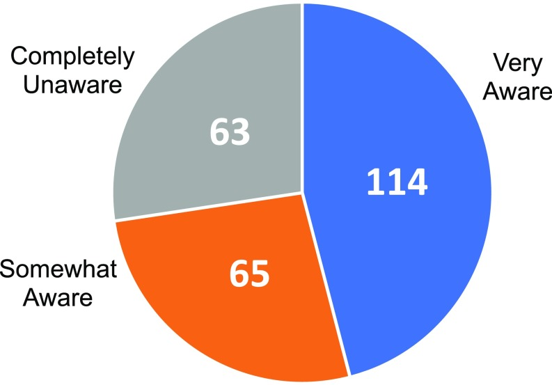
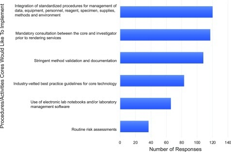

## Inserting Images

You can add images to an R Markdown report using markdown syntax as follows:
``````

However, when you knit the report, RStudio will only be able to find your image if you have placed it in the right place - RELATIVE to your .Rmd file. This is where good file management becomes extremely important. We have placed all our images in the `figs` folder. In that case, make sure your path starts with `figs/` along with the correct image name and file extension. Also the closing bracket and the opening parentheses should be close to each other, without any spaces in between.

> ## Tip: Paths to Files
>The specification of the list of folders to travel and the file name is called a path. A path that starts at the root folder of the computer is called an **absolute path**. A **relative path** starts at a given folder and provides the folders and file starting from that folder. Using relative paths will make a number of things easier. A path is made up of folder names. If the path is to a file, then the path will ends with a file name. The folders and files of a path are separated by a directory separator. There are a few special directory names. A single period `.` indicates the current working directory. Two periods `..` indicates moving up a directory. 
>
{: .callout}


In our paper template there are three images (two pie charts) and one bar chart we want to include. Those are named fig1_paper.jpg, fig2_paper.jpg and fig3_paper.jpg.

To start let’s identify where (Figure 1) is mentioned in the paper. We will insert the image right after that. This image will have the caption labeled "FIGURE 1 - Knowledge and awareness of the current NIH guidelines on rigor and reproducibility." (that we will be pasting in the chat). We need that caption to render the image. 
  
The markdown should look like:

```

```

**Note:** A preview of your image should pop up automatically in RStudio if you have the correct relative path. 

This will output as:




### Resizing Images 

The image you just added looks a little too big, right? We can resize it by adjusting the width and height ratio. Let’s say we want this image to be half of the original size. In order to do that, we will have to add to the syntax: 

```
{width=50% height=50%}
```
This will output as:
<figure>

<figcaption>FIGURE 1 - Knowledge and awareness of the current NIH guidelines on rigor and reproducibility.</figcaption>
</figure>


>## CHALLENGE 5.1 - Inserting Images
>
> Locate the places for Figures 2 and 3 and add them to the document using the captions below:
>
> FIGURE 2 - Lack of requests for rigor and reproducibility documentation by users of shared resources
>
> FIGURE 3 - Types of tools that cores would like to implement in their operations
>
> *The bar chart should use a ratio of 60% x 80% in order to improve readability.
> >
> > ## Solution:
> >
> > ```
> > {width=50% height=50%}
> > ```
> > ```
> > {width=60% height=80%}
> > ```
> {: .solution}
{: .challenge}

> ## Time to Knit!
> Check how your images look now. 
{: .checklist}


### Aligning Images 

Similar to text all images are aligned to the left by default in R Markdown. If we want images to be center aligned we can add to the syntax `fig.align="center"`.

```
{width=60% height=80% fig.align="center"}
```
<br>
Outputs as:
<center>
<figure>

<figcaption>FIGURE 1 - Knowledge and awareness of the current NIH guidelines on rigor and reproducibility.</figcaption>
</figure>
</center>


> ## Time to Knit!
> Check how the images are aligned now. 
{: .checklist}


>## Tip
> But if we want to be more effective and get all images aligned in a certain way, it is best to 
  apply a more general code chunk that will be covered later on, in the Knitr syntax.
{: .callout}


## Inserting Tables

We can also use markdown syntax to insert a formatted table into our document. The basic syntax to insert a table looks like this:

```
Column Header | Column Header
---           | ---         .     
Cell 1        |  Cell 2     .    
Cell 3        |  Cell 4     .      
```
<br>
Start with the column names/headers. Separate columns with the pipe ( | ) symbol. Right below the column headers use at least three dashes to separate the headers from the cells of the table. Then fill in the contents of the table row by row, separating columns using the pipe ( | ) symbol. 


> ## Note: Table Spacing
>the spacing between cells in each row can help with readability in the R Markdown file, but is not necessary to get the correct output. As long as the pipe symbol is there, R Markdown will automatically format the table in your output. The following syntax will print the same table as the spaced out table above.
> 
> ```
> Column Header|Column Header
> --- |---
> Cell 1|Cell 2
> Cell 3|Cell 4
> ```
{: .callout}


You can use text emphasis in the table using the same syntax as you use when emphasizing other 
  plain text. The following change will bold the column headers in the output. 
 ```
 **Column Header** | **Column Header**
 ---               | ---             .
 Cell 1            |  Cell 2         .
 Cell 3            |  Cell 4         .
 ```
<br>

Let’s create Table 1 in our paper in section 3.2 Current Landscape for Rigor and Transparency in Represented Shared Resources. 

Start with the column headers “Category” and “N” in bold. Then add the separator between the header and the cells. We’ll also type out the first two rows of the table.


> ```
> **Category** | **N**
> --- | ---
> Poor sample quality from users/sample variability/limited biological material | 51
> Lack of well-trained principle investigators and lab members/Poor oversight | 45
> ```
{: .source}


> ## CHALLENGE 5.2 - Complete the Table
>
> Finish Table 1 by adding the rest of the rows.
>
>> ## SOLUTION
>> ```  
>> **Category** | **N**  
>> --- | ---  
>> Poor sample quality from users/sample variability/limited biological material | 51  
>> Lack of well-trained principle investigators and lab members/Poor oversight | 45  
>> Poor experimental design: Lack of sufficient replicates/inadequate sample size/lack of adequate controls | 43   
>> Inadequate standardization of protocols or guidelines, and data analysis | 43   
>> Cost and time | 39   
>> Failure to leverage the core’s expertise/following the core’s advice/no consulting beforehand | 23   
>> Inadequate documentation of experiments/data management | 19   
>> Instruments: maintenance, upgrades, changes | 15   
>> Responses that could not be assigned to a category | 11  
>> ```
> {: .solution}
{: .challenge}


> ## Time to Knit!
> Check how the table you have just created looks like. 
{: .checklist}

> ## Note: Advanced & Interactive Tables
> There are some packages that allow you to make more advanced and interactive tables. Here are some references for these packages: [https://cran.r-project.org/web/packages/kableExtra/vignettes/awesome_table_in_html.html](https://cran.r-project.org/web/packages/kableExtra/vignettes/awesome_table_in_html.html) and [https://www.htmlwidgets.org/showcase_datatables.html](https://www.htmlwidgets.org/showcase_datatables.html)
{: .callout}
