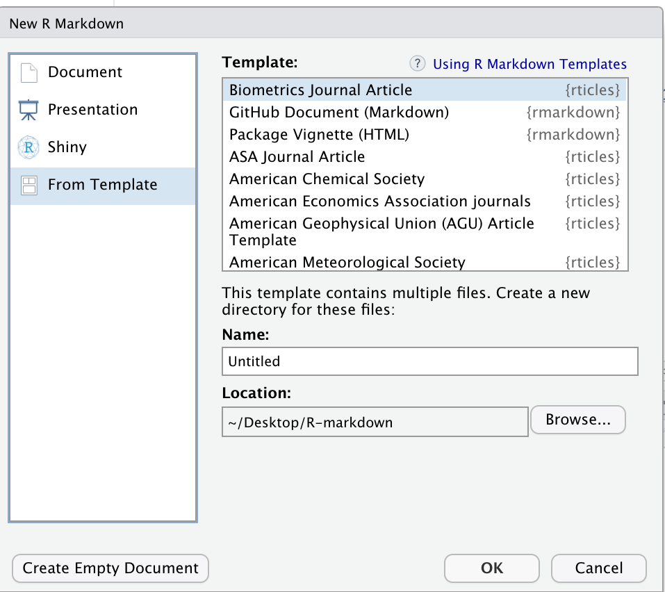

## Installing the "rticles" Package

We have learned how to start a new document on RStudio and apply some important R Markdown syntax to format your reports. But, let’s say you are writing a paper and you already know which journal you are submitting it to. Writing it in your own style and then formatting prior to submission would be too time-consuming, right? The good news is that RStudio can make our lives easier! Through a package called “rticles” you can access a number of existing journals’ templates that will let you easily and quickly format and prepare your paper draft for peer review.

Let’s take a look at that! On RStudio, install the package using the command `install.packages("rticles")` or by clicking install on the right-hand side pane and typing rticles. Once the installation is completed, use the plus icon at the upper-left side of your screen to create a new document or proceed with File>New File>Markdown. This will prompt the window bellow:

 

Clicking on “from template” will prompt a couple of dozen templates listed as `{rticles}`. Let’s choose the Biometrics Journal template and then, OK. 

Note that along with the skeleton of the paper you will see a message on top indicating additional packages you may need to install for that particular template. Creating templates and adding other templates is beyond the scope of this workshop, but that is also possible. To learn more you can check the link [Using R Markdown Templates](https://bookdown.org/yihui/rmarkdown/document-templates.html) on the right-hand side or check the [rticles package documentation](https://cran.r-project.org/web/packages/rticles/rticles.pdf).
