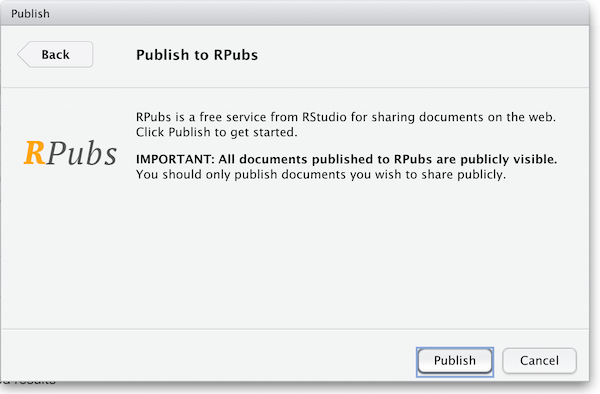
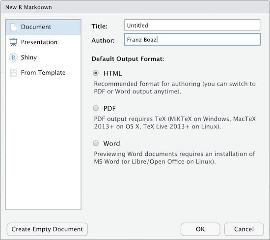

## Changing the behavior of the Knit Button

In episode 2 we said we would show you later on how to change the behavior of the knit button so you could conform to best practices for organizing your R project. We would prefer to save the output to the `results` folder instead of the `code` folder because it's best practice to save your outputs (whether knit rmd documents, the outputs of r scripts, or cleaned data) in a folder separate from your 'raw' code and data. That way for instance, you can avoid deleting or saving over your raw data and you can save different iterations of your outputs without worry. 

R Studio provides options to set the output type and a few other things but does not let the user select a destination folder for knitr output.  But users CAN however add code to the yaml which allows finer control of the behavior of the knit button. Once you've set directives in the header YAML section of your R-markdown file everytime you hit 'knit', R Studio follows your customized directives as it processes the code to render your output. 

So, let's copy and paste the the following to our yaml header (placing the code after the bibliography and/or csl section should work.):

```
...
...
knit: (function(inputFile, ...) { rmarkdown::render(inputFile, output_dir='../results') })
---
```

#### What's going on in this YAML code we're adding:


**knit** we are changing the behavior of the knit function by defining our own:

**function(inputFile, ...)** as stated above we are defining our own function by calling `function()` so we can re-design what happens when we hit 'knit'. `inputFile` is the main parameter required for our `render` function. This just means that the input file is 'this' file - the .rmd file we are *knit*ing.

**rmarkdown::render** When you click the *knit* button R-Studio runs `rmarkdown:render`.  
Typing `?rmarkdown::render` in the console will bring up further information about the `rmarkdown:render` function. We will be using two arguments of `rmarkdown::render`.

- *input*: The file we're feeding the function. We already determined this is `inputFile` or 'this' document.
- *output_dir*: designates which folder we want to save the knit document to (relative path). In our case we know this is the `results` folder so we use `..` to go back to our root directory (from the code folder). The "default" folder is the folder where your rmd file is saved, so any 'directions' you give by indicating a relative path will be from the folder where the rmd file is to the folder where you want to save the html rendered document.
  
> ## Time to Knit!
> Check if your html file was saved to the `results` folder.   
{: .checklist}

##  Rendering R Markdown script 

Once you have your `.Rmd` document refined and the _Knit_ output looks good it is ready to publish.  When using RStudio the simplest option is to publish to [Rpubs.com](https://rpubs.com).  Rpubs is a bare-bones web hosting service created for the sole purpose of hosting RMarkdown documents.  It provides no other services--- no support for search, collaboration, persistent identifers, or versioning.  But, it is the simplest and most direct way of getting your RMarkdown document published on the web directly from RStudio.  For a more full-featured hosting service consider GitHub and GitHub Pages, described later.

Notice the "Publish" button in the upper right corner of your _Knit_ output.  Click this to publish to Rpubs.  This is where you'll need an Rpubs account as mentioned in [setup](/setup.html) 
for this workshop.  

Click the publish button 


and you'll be presented with the following panels:


(The other option in the dialog box, RStudio Connect, is a standalone publishing platform for teams to share content.  It requires purchase to host and use.)



The first time you publish, RStudio will likely ask if you want to install some needed packages; say yes.  RStudio will then open up a web browser to allow you sign in to rpubs.com.

At the end of the publish process your paper will be live on the internet 
with a URL similar to: `https://rpubs.com/yourname/678624`

RStudio also saves an HTML version of your *knit* document to your local file system.  Look for it in the *results*
directory in the same directory as the R-markdown file in your R-Studio project directory.  
This html document is self-contained and highly portable.  Images are encoded directly into the HTML so you can easily move it to any web hosting you have available.


## Publishing as website on GitHub*

Another, better, but slightly more involved option for publishing an RMarkdown document on the web is to use GitHub and GitHub Pages.  It is out of the scope of this lesson to use GitHub, but briefly, GitHub is a widely-used version control and collaboration system.  RStudio has built-in support for GitHub: in the upper right panel of your RStudio window, look for the Git tab, which allows you to sync your RMarkdown project with a remote repository stored on [github.com](https://github.com).  To enable publishing to GitHub Pages, go to the Settings page of your repository on GitHub and select a branch ("branch" is a repository term) to publish.  Name your main RMarkdown file `index.Rmd`, and render it to HTML as `index.html`.  With GitHub Pages enabled on your repository, the HTML file in your repository at https://github.com/myusername/myrepo/index.html will appear on the web as https://myusername.github.io/.

## Other document types

When you create a new R-markdown file in R Studio you are presented with a choice of Output Formats:



For the purposes of this workshop we're using HTML as the output format but other types are available.  You can render your R Markdown as a document, a presentation or a *Shiny* app.  With the default installation of R-Studio HTML output is most likely to work.  Other formats may require additional R packages and/or code libraries be installed on your computer.  R Studio also has a templating system to help with creating R Markdown files with common elements, YAML metadata and rendering instructions.  This can be very helpful for example if you want to create a weekly or monthly report documenting an ongoing experiment, study or other changing data.


