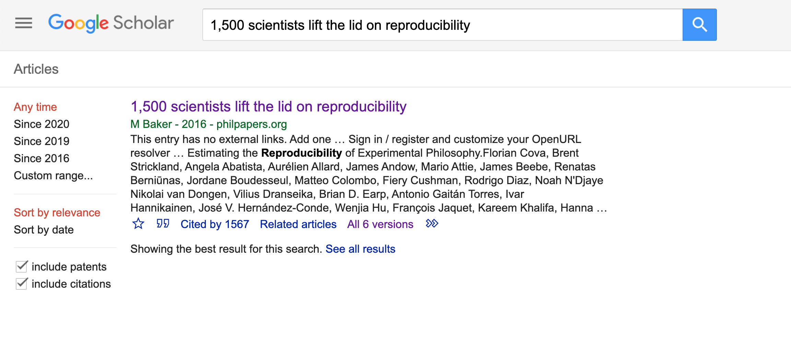
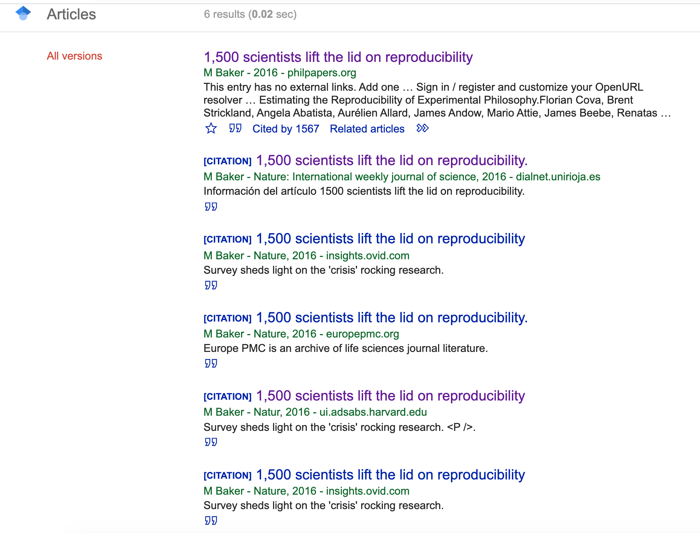
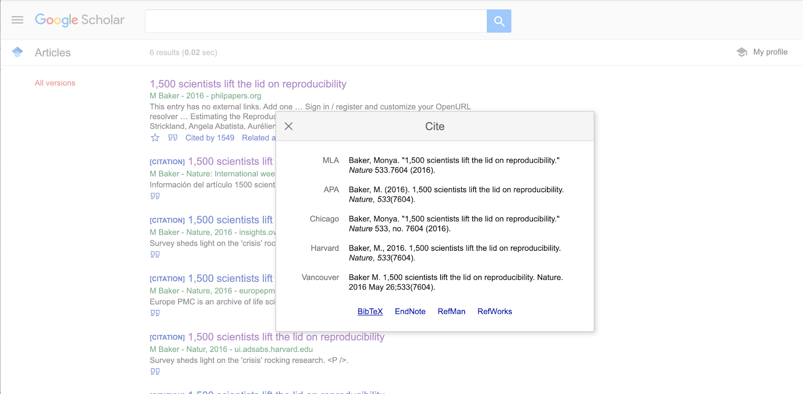

```{r, include=FALSE}
source("../bin/chunk-options.R")
knitr_fig_path("07-")
```

## Getting the Bibliography

Let's now move our attention to include citations and list out the references (bibliography) in our paper example. Before adding citations we need to list out all citable items and set a bibliography. In order to add a bibliography we will need to include a bibliography file in the YAML header. Bibliography formats should be specified in one of the formats supported by Pandoc on RStudio:

* MOD: _.mods_
* BibLaTeX: _.bib_
* BibTeX: _.bibtex_
* RIS: _.ris_
* EndNote: _.enl_
* EndNote XML: _.xml_
* ISI: _.wos_
* MEDLINE: _.medline_
* Copac: _.copac_
* JSON citeproc: _.json_

Note that bibliography formats are not the same as citation styles. These are specified by a CSL (_Citation Style Language_) that we will cover later on. For now, we will stick to the bibtex format supported by Google Scholar, which will be used to retrieve example references for our practice paper. If you use a reference manager such as Zotero, Endnote, Mendeley etc. to manage your library, you can also export the .bibtex file directly, with all citable items you consider to include in the paper.


A `\*.bibtex` file consists of bibliography in plain-text format. Go to your `R-markdown` project folder, then `paperToRmd` then `docs` and open the `bibliography.bibtext`. We already have a couple of citable items listed in this file. But for the sake of practice, let's delete all items from line 23 onwards, and keep only 2 items, as below:

```

@misc{nature\_nature\_2018,

type = {Repository},

title = {Nature {Reproducibility} survey 2017},

url = {10.6084/m9.figshare.6139937.v4},

journal = {Figshare},

author = {Nature},

year = {2018},

}

@article{springer\_reality\_2016,

title = {Reality check on reproducibility.},

volume = {533},

doi = {10.1038/533437a},

number = {7604},

journal = {Nature},

author = {Springer, Nature},

month = may,

year = {2016},

pages = {437},

}
```

Note that the first line specifies the type of citation, MISC for _miscellaneous_, and Article for _papers_, along with the main entry which will be used to link in-text citations further in the episode. The other lines include the metadata that describes different parts of the bibliography, such as the date, the author, etc.

Now let&#39;s collect the other citations we will need to include in our paper:

We want to add other more items to our bibliography list to be then cited in the paper. Let's add the paper: `1,500 scientists lift the lid on reproducibility` authored by Baker (2016).

To do so, follow the steps below:

* 1 Search for the first paper listed on Google Scholar by copying and pasting the title of the paper. Make sure to use quotations to better filter results and get the right paper.A tricky part is that if you want more completed files that will render to more accurate citations you have to check for existing versions (if any) of the same result. Google Scholar amasses them altogether into one in the link &quot;All 6 versions&quot;, listing out different repositories and websites the paper must be living in.



* 2 Click on the link to check for other existing versions. The first result does include the journal name, so let's choose the second one instead, which won't require us to adjust the metadata.



* 3 When you click on the quotation icon right below the version you chose, it will prompt a window that will give you the option to choose BibTeX.




* 4 Choose the BibTeX option. It will prompt a file in your browser, like this:

```
@article{baker20161,

title={1,500 scientists lift the lid on reproducibility.},

author={Baker, Monya},

journal={Nature: International weekly journal of science},

volume={533},

number={7604},

pages={452--455},

year={2016},

publisher={Macmillan}

}
```

* 5 Copy and paste this to your bibliography.bibtex file. The order is not important. You can either copy before or after items provided. All items will be organized according to the style. It is strongly recommended to have entries separated by blank lines. That makes them look like paragraphs, and easier to locate.

> ## Challenge 7.1: Complete the .bibtex file 
>
> Follow the same process to add three references to the bibtex file:
> `The reproducibility of biomedical research: sleepers awake!` By Bustin (2014).
> `Reproducibility2020: progress and priorities` By Freedman, Venugopalan, &amp; Wisman (2017).
> `A manifesto for reproducible science` By Munafò et al. (2017).
>>## Solution
> Your bibliography.bibtex file tab should have a total of six items once you complete this task. 
```
> @article{bustin_reproducibility_2014,
>	title = {The reproducibility of biomedical research: {Sleepers} awake!},
>	volume = {2},
>	issn = {2214-7535},
>	shorttitle = {The reproducibility of biomedical research},
>	url = {http://www.sciencedirect.com/science/article/pii/S2214753515000030},
>	doi = {10.1016/j.bdq.2015.01.002},
>	abstract = {There is increasing concern about the reliability of biomedical research, with recent articles suggesting that up to 85\% of research funding is wasted. This article argues that an important reason for this is the inappropriate use of molecular techniques, particularly in the field of RNA biomarkers, coupled with a tendency to exaggerate the importance of research findings.},
>	language = {en},
>	urldate = {2020-11-13},
>	journal = {Biomolecular Detection and Quantification},
>	author = {Bustin, S. A.},
>	month = dec,
>	year = {2014},
>	keywords = {Biomedicine, Cancer, Microarrays, Next generation sequencing, Reproducibility, qPCR},
>	pages = {35--42},
}
> @article{freedman_reproducibility2020_2017,
>	title = {Reproducibility2020: {Progress} and priorities},
>	volume = {6},
>	issn = {2046-1402},
>	shorttitle = {Reproducibility2020},
>	url = {https://www.ncbi.nlm.nih.gov/pmc/articles/PMC5461896/},
>	doi = {10.12688/f1000research.11334.1},
>	urldate = {2020-11-13},
>	journal = {F1000Research},
>	author = {Freedman, P. and Venugopalan, G. and Wisman, R.},
>	month = may,
>	year = {2017},
>	pmid = {28620458},
>	pmcid = {PMC5461896},
}
> @article{freedman_reproducibility2020_2017,
>	title = {Reproducibility2020: {Progress} and priorities},
>	volume = {6},
>	issn = {2046-1402},
>	shorttitle = {Reproducibility2020},
>	url = {https://www.ncbi.nlm.nih.gov/pmc/articles/PMC5461896/},
>	doi = {10.12688/f1000research.11334.1},
>	urldate = {2020-11-13},
>	journal = {F1000Research},
>	author = {Freedman, P. and Venugopalan, G. and Wisman, R.},
>	month = may,
>	year = {2017},
>	pmid = {28620458},
>	pmcid = {PMC5461896},
}
```
>>{: .output}
>{: .solution}
{: .challenge}


> ## Tip: 
> 
>Alternatively, you can also conduct multiple searchers and save results to your personal library on Google Scholar and export multiple items as.bibtex files in a bulk.
>
{: .callout}

We should now have a complete .bibtex file with all items we need to proceed. But how will RStudio be able to link this file with the .rmd file on the other tab? Well, remember we mentioned early on that we should include a bibliography file in the YAML header? In this case we will add to the existing YAML the following information:

```
---
bibliography: bibliography.bibtex
---

```

The connection between the two files is all set to get us started. For now, we won't need to specify which format we would like to use. By default, Pandoc will use a Chicago author-date format for citations and references and we will stick with that for now, but later we will learn how to change citation styles.

### Adding Citations

Each item in the bibliography.bibtex file starts with a @ entry which specifies the type of document followed by a curly opening bracket which specifies the key that should be included to create in-text citations.

It is important to use this exact key to render correct mentions in the text. Let&#39;s see how that should be included in the R Markdown syntax.

#### Single citation

At the end of the first paragraph on the Introduction, where you find `[citation example 1]`. Remove this info and let&#39;s practice adding our first citation. Let&#39;s use the item with the key `freedman\_2020\_2017` from the bibliography.bibtex file in the second tab. In order to cite this work you should add this key after an &quot;@&quot; in between brackets, as follows:

```
[@freedman\_2020\_2017]

The output you will get in Chicago style will be:

(Freedman, Venugopalan and Wisman 2017)

```

> ## Challenge 7.2: Adding single citation
>
> Locate `[citation exercise 1]` in the document, and replace it by a citation to Mufano's (2017) study.
>> ## Solution
> `[@munafo\_manifesto\_2017]` 
> The output you will get in Chicago style will be: `(Mufano, 2017)`
>> {: .output}
> {: .solution}
{: .challenge}


#### Multiple Citations

If you want to add multiple citations in a row (same parenthesis) you will have to separate keys by semicolon. So let&#39;s complement the citation we created earlier in the first paragraph by adding Bustin&#39;s to it. Let's practice that in the place marked as `[citation example 2]`

`[@bustin\_reproducibility\_2014; @freedman\_reproducibility2020\_2017]`

The output you will get in Chicago style will be:

`(Bustin, 2014; Freedman, Venugopalan and Wisman, 2017)`

*Tip:* You can simplify items key if you want. For instance, you can keep only the first author and year, but for the purpose of the exercises we will keep keys exactly how exported from Google Scholar.


> ## Challenge 7.3: Adding multiple citations
>
> Now it is your turn! Locate in the document the note `[citation exercise 2]`. Remove it and include a citation to Baker (2016) and Freedman, Venugopalan and Wisman&#39;s (2017) studies.
>> ## Solution
> `[@baker\_1500\_2016; @freedman\_reproducibility2020\_2017]`
> The output you will get in Chicago style will be: `(Barker, 2016; Freedman, Venugopalan and Wisman, 2017)`
>> {: .output}
> {: .solution}
{: .challenge}


#### Keeping Authors in the narrative

There are cases authors are announced in the text, and therefore their names shouldn&#39;t go between parenthesis. Let&#39;s say you want to add a citation to support the statement about Springer&#39;s survey. In order to keep the institutional author out of the parentheses, we should add a - sign before the @ followed by the citation key. Let's add that to the `[citation example 3]` remark on the paper, as it follows:

&quot;A recent survey conducted by_Springer_ `[-@springer\_reality\_2016]` reported that 90%...&quot;

The output you will get will be:

&quot;A recent survey conducted by Springer (2016) reported that 90%...&quot;


> ## Challenge 7.4: Keep author(s) in the narrative 
> 
> Let&#39;s practice now how to insert citations outside the paranthesis! In the same paragraph, where you find `[citation exercise 3]` add a citation (year only) to your mention to Nature&#39;s survey in order to indicate the dataset you are referring to.
>> ## Solution
> `[-@nature\_nature\_2018]`
> The output you will get will be: `Nature (2018)`
>> {: .output}
> {: .solution}
{: .challenge}


### Setting the Reference List

All cited items will be listed under the section **References** which you created before while practicing headings and subheadings. Items will be placed automatically in alphabetical order.


#### Add an item to a bibliography without citing it

By default, the bibliography will only display items that are directly referenced in the document. If you want to include items in the bibliography without actually citing them in the body text, you can define a dummy nocitemetadata field and put the citations there.

```

nocite **:** |

@item1, @item2

```

#### Add all no-cited items to the bibliography

If we do not wish to explicitly state all of the items within the bibliography but would still like to show them in our references, we can use the following syntax:

```

nocite: |
  @item1, @item2
  
```

Note that this will force all items to be displayed in the bibliography.

### Changing Citation Styles

There are a number of existing [citation styles](https://editor.citationstyles.org/about/) (CSL), but we won&#39;t cover their differences and applications during this workshop. To use another style, we will need to specify a CSL (Citation Style Language) file in the metadata field in the YAML header.

Let's assume that we want to use the APA 5th edition [apa-5th-edition.csl](https://github.com/citation-style-language/styles/blob/master/apa-5th-edition.csl). In order to do so, you have to make sure the CSL you want to apply is correctly named in the YAML, matching the .csl file saved in the project folder and opened in RStudio. Your YAML should look similar to this:

```
title: "An Adapted Survey on Scientific Shared Resource Rigor and Reproducibility"

author: Your Name

date: "December 15, 2020"

output:

html\_document:

number\_sections: true

bibliography: bibliography.bibtex

csl: apa-5th-edition.csl

```

Knit the document and note that citations and references now conform to the APA style.

> ## Tip: 
> You can override this default by copying a CSL style of your choice to default.csl in your user data directory.The CSL project provides further information on [finding and editing styles](https://github.com/citation-style-language/styles). More information about CSL can be found here [https://docs.citationstyles.org/en/1.0.1/primer.html](https://docs.citationstyles.org/en/1.0.1/primer.html).
>
{: .callout}