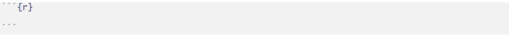
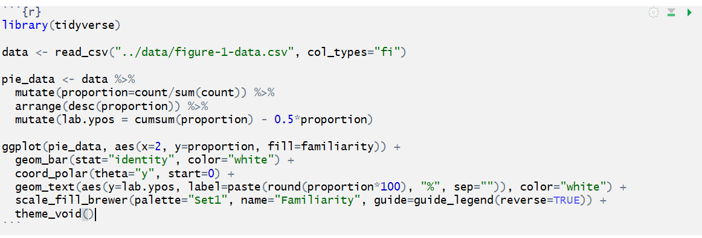
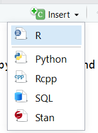

```{r, include=FALSE}
source("../bin/chunk-options.R")
knitr_fig_path("09-")
```

```{r code_data_library, include=FALSE}
#load library
library(tidyverse)
#load data
data1 <- read_csv("../paperToRmd/data/figure-1-data.csv", col_types="fi")
```
## What is Knitr?
Knitr is the engine in RStudio which creates the "dynamic" part of R markdown reports. It's specifically a package that allows the integration of R code into the html, word, pdf, or LaTex document you have specified as your output for r markdown. It utilizes [Literate Programming](https://en.wikipedia.org/wiki/Literate_programming) to make research more reproducible. There are two main ways to process code with Knitr in R Markdown documents:  

1. Inline code  
2. Code Chunks  

## Adding Inline code

Inline code is best for calculating simple expressions integrated into your narrative.
For example, use inline code to calculate an error margin or summary statistic, such as # of observations, of your dataframe in your results section. One of the benefits of using this method is if something about your data set changes (like leaving out NAs or null values) the code will automatically update the calcuation specified.

We're going to go ahead and change the LaTex code we used to input the error margin and calculate it dynamically using r code. So, instead of `$ \pm 3 \% $` to display our error margin as +/-3%, let's add this:

> ```{r eval = FALSE}
> `r round(1.96*0.5*(1-0.5)/sqrt(243))*100)`%  
> ```
{: .source}

Notice how we put the % sign after the ticks. In this case the percentage sign should be plain text. If we had put it inside the ending hash mark (`) r would have attempted to calculate the modulo since that's what that symbol stands for in R. 

Where else can we add inline code? We can replace observation counts!

i.e. "There are `#r nrow(my_data)` individuals who completed the survey"

Now, we're going to find one such example in our data frame and convert a static number or equation to inline code. In our paper text we read "a total of 243 individuals from 21 countries completed this section." Here we can use inline r code to calculate the total responses instead of typing it in. 

However, because we don't have access to the original dataset (and thus only aggregate counts) we can't use `nrow()` to count our number of observations. we will count the column `count` in our `data1` dataframe which sums the responses relating to how familiar respondents are with current NIH guidelines on reproducibility and is used to create Fig 1. We will use *r sum(data1$count)* in between the tick marks instead to total the count for each level of familiarity ("Very Aware", "Somewhat Aware", "Completely Unaware").

We will add the inline code to the sentence in question:

> ```{r eval = FALSE, echo = TRUE}
> a total of `r sum(data1$count)` individuals from 21 countries completed this section.
> ```  

```
**Output:** "a total of `r sum(data1$count)` individuals from 21 countries completed this section."
```
Oh! Wow we were off on out total count by one anyway, good thing we added this inline code!

> ## Tip: Inline code cannot span lines  
> You need to be sure that these in-line bits of code aren’t split across lines in your document. Otherwise you’ll just see the raw code and not the result that you want.  
{: .callout}


> ## CHALLENGE 9.1 - Converting a static number to inline code
> There are two more spots in the paper where the count 243 was stated (search '243' or look just around the paragraph we just edited) Find both and replace with code. What part of the paper is that? 
>
>> ## SOLUTION
>> ```{r eval = FALSE, echo = TRUE}
>> 1. the margin of error is ±`r round(1.96*0.5*(1-0.5)/sqrt(sum(data1$count))*100)`%
>> ```
>> Note: since this we just added inline code to calculate the error margin, we can just add this snippet to count the total respondents, this means we only need to substitute `sum(data1$count)` for 243 (and don't need to add the hashes and `r` a second time.
>> ```{r eval = FALSE, echo = TRUE}
>> 2. sample size $n=`r sum(data1$count)`$
>> ```
>> Note: Look at that! you can add r inline code in LaTex formatting, it evaluates the r code and then displays in LaTex format!
>>
> {: .solution}  
{: .challenge}

## Inserting Code Chunks
Code chunks are better when you need to do something more sophisticated with your code, such as building plots or tables. There is also syntax which allows you to change how that code gets rendered. We’ll learn more about that as we walk through the “anatomy” of a code chunk.  

### Basic Anatomy of the Code Chunk
You can quickly insert chunks like these into your file with:

* the keyboard shortcut Ctrl + Alt + I (OS X: Cmd + Option + I)
* the Add Chunk  command in the editor toolbar
* or by typing the chunk delimiters ````{r} and ````.

The most basic code chunk looks like so:

``` {r, eval=FALSE, echo=TRUE}
#Some code here
```

Other than our hashes ``` for code chunks that surround the code top and bottom, the only necessary piece is the specified language (r) placed between the curly brackets. This indicates that the language to read the code is R. 

> ## Fun fact: Other Programming Languages
> Although we will (mostly) be using R in this workshop, it’s possible to use other programming or markup languages. For example, we have seen that we can use LaTeX code for equations. You can also use python too, and we (may) show an example with css. Other languages include: sql, julia, bash, and c, etc. It should be noted however, that some languages (like python) will require installing and loading additional packages. 
{: .callout}

### Add a code chunk

Ok, let's add some code! Earlier, we added three images to our document. Now, images of our plots are great and all, but since R Markdown allows us to evaluate live code it would be more reproducible to use code chunks to display those plots. Like with our inline code, this assures that if there are any changes to the data, the plots update automatically. This also makes our life easier because when there's a change we don't have to re-generate plots, save them as images and then add them back in to our paper. This will potentially help prevent version errors as well!  So we're actually going to go ahead and convert a few of our plots to code chunks.

We'll start by typing our our starting hashes & r between curly brackets. (in your own workflow you may want to add the ending three hashes as well so you don't forget after adding your code):



Now, let's open our `plot-figure-1.r` file in our `code` folder. Copy the code and paste it in between the two lines with hashes.




> ## Tip:
> There's actually a button you can use in the RStudio menu to generate the code chunks automatically. Automatic code chunk generation is available for several other languages as well. Also, you can use the keyboard shortcut `ctrl`+`alt`+`I` for Windows and `command`+`option`+`I` for Mac. 
> 
{: .callout}

### Run your code

Now, to check to make sure our code renders, we could click the "knit" button as we have been doing. However, with the code chunks we have other opportunities for rendering. 

1) Knit button - knitting will automatically run the code in all code chunks

2) Run from Rmd file (chunk run button)

3) Run menu 

4) Keyboard shortcuts: 
Task	Windows & Linux	macOS
Run all chunks above	Ctrl+Alt+P	Command+Option+P
Run current chunk	Ctrl+Alt+C	Command+Option+C
Run current chunk	Ctrl+Shift+Enter	Command+Shift+Enter
Run next chunk	Ctrl+Alt+N	Command+Option+N
Run all chunks	Ctrl+Alt+R	Command+Option+R
Go to next chunk/title	Ctrl+PgDown	Command+PgDown
Go to previous chunk/title	Ctrl+PgUp	Command+PgUp


### Name your code chunks

While not necessary for running your code, better practice is to give a name to each code chunk:

```` {r chunk-name} ````


Some things to keep in mind
- The chunk name is the only value other than r in the code chunk options that doesn’t require a tag (i.e. echo=FALSE)
- The chunk label has to be unique (i.e.you can't use the the same name for multiple chunks)

We’ll see in a bit where this code chunk label comes in handy. But, for now let's go back and give our first code chunk a name:

FIXME add naming plot1


> ## Tip: Don't use spaces, periods or underscores in code chunk labels
>Try to avoid spaces, periods (.), and underscores (_) in chunk labels and paths. If you need separators, you are recommended to use hyphens (-) instead. For example, setup-options is a good label, whereas setup.options and chunk 1 are bad; fig.path = 'figures/mcmc-' is a good path for figure output, and fig.path = 'markov chain/monte carlo' is bad. See more at: https://yihui.org/knitr/options/
{: .callout}

### Code Chunk Options

There are over 50 different code chunk options!!! Obviously we will not go over all of them, but they fall into several larger categories including: code evaluation, text output, code style, cache options, plot output and animation. We’ll talk about a few options for code evaluation, text output and plot output specifically.

Again, The chunk name is the only value other than r in the code chunk options that doesn’t require a tag (i.e. the "= VALUE" part of `option = VALUE`). So these chunk options will always require a tag whose syntax looks like:

`{r chunk-label, option = VALUE}`

the option always follows the code chunk label (don't forget to add a `,` after the label either). 


#### Some common options: 

**eval** = (logical or numeric) TRUE/FALSE to evaluate (or not) or a numeric value like c(1,3) (only evaluate expressions 1 and 3).    
**echo** =  whether to display source code or not (logical or numeric - following the same rules as above)    
**warning** = whether to display the warnings in the output (TRUE). FALSE will output warnings to the console only    
**include** = whether to include the chunk output in the output document    
**hide** = Specifically for plots, tells the code chunk to generate plots but not to display them in the output    
 
 
> ## CHALLENGE 9.2 - Rendering Codes
> How will some hypothetical code render given the following options?
> ```
> ```{r global-chunk-challenge, eval = TRUE, include = FALSE}
> #Some r code here
> ```
> ```
>> ## SOLUTION
>> The expressions in the code chunk will be evaluated, but the output will not be included in the knit document.   
>> When might you want to use this?   
>> If you need to calculate some value or do something on your dataset for a further calucation or plot, but the output is not important to be included in your paper narrative. 
> {: .solution}
{: .challenge}


> ## CHALLENGE 9.3 - Add a code chunk on your own
>
> Now, let's add the code to regenerate Figure 3 from the r script `plot-figure-3.r` in the `code` folder. Go ahead and load the data in the chunk at the top of your paper with our other data and make a new code chunk (with a name) with the options set to eval = TRUE and echo = TRUE with the code that renders the plot.
>
>> ## SOLUTION
>> 1. add to `code-chunk-name` here: to load the data
>> ```
>> ```
>> 2. create a new code chunk at the spot in the paper we want figure 3 and add the following code:
>> ```
>> ```
> {: .solution}
{: .challenge}


## Global Code Chunk Options:
On each of our two plots we set the options separately (though we used the same options and values). However, we may have quite a few code chunks in our paper and it might be a lot of work to keep track of what options we're using throughout the paperWe can automate this process by setting the options once at the beginning of the document (FIXME same with libraries?). Then, each code chunk that runs will refer to the default options we set one time at the beginning of the file. 

To set global options that apply to every chunk in your file, call we will call `knitr::opts_chunk$set` in a code chunk right after our yaml header. Knitr will treat each option that you pass to knitr::opts_chunk$set as a global default. 

```{r global-options, eval=FALSE, echo=TRUE}
# knitr::opts_chunk$set(ADD options here)
```

*Code chunk options must all appear on the same line, no returns

ok, now let's go back and remove the options we set in the individual code chunks & since we've set the global options in the document instead. 

“If I’m writing a report for a collaborator, I’ll often use include=FALSE to suppress all of the code and largely just include figures.” - Karl Broman

*Note: We can also tweak some settings in our yaml which changes how code chunks are displayed. We're not going to get into this in the workshop, but many of the same options you set in your global code chunk settings are also configurable in the yaml. 

#### load our libraries and data "globally"
We can actually make our lives easier in one other way too. So far we've loaded the library and dataframe we need in each code chunk individually which so far has meant we've loaded the `tidyverse` library twice. Instead we can do this all at the beginning which lets us avoid the repitition. Once libraries and data are loaded they are available for the rest of the rmd document. So, if we load libraries and data at the start, when there is code that calls on them it's already available. This also makes it easier for us to keep track of all the libraries and data we need to use in any given document. If anything needs to be tweaked, we don't need to search through every code chunk in our rmd document to make a change. 

FIXME 

> ## Tip: Overiding global options  
> What if you want most of your code chunks to render with the same options (i.e. echo = FALSE), but you just have one or two chunks that you want to tweak the options on (i.e. display code with echo = TRUE)? Good news! The global options can be overwritten on a case by case basis in each individual code chunk.
{: .callout}


> ## CHALLENGE after global options:

How would the following code chunk be displayed when we knit:

xxxxxxx

...considering the global chunk setting’s were was as listed: 

xxxxxxxxxxxxxxxxx,
