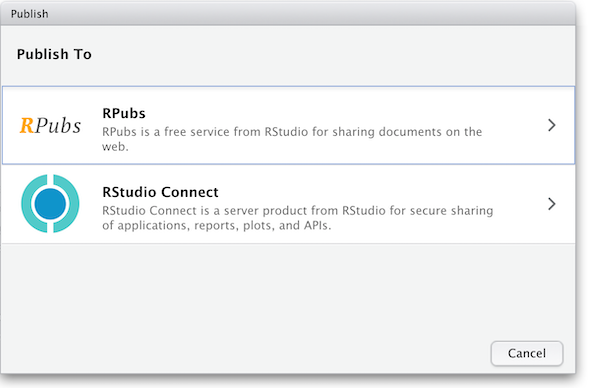

### 11.1 Rendering R Markdown script 

Once you have your `.Rmd` document refined and the _Knit_ output looks good it 
is ready to publish.  When using R-Studio the simplest option is to publish to Rpubs.com.
Notice the "Publish" button in the upper right corner of your _Knit_ output.  

This is where you'll need an Rpubs account as mentioned in [setup](#FIXME) 
for this workshop.  

Click the publish button 

and you'll be presented with the following panels:

At the end of the publish process your paper will be live on the internet 
with a URL similar to: `https://rpubs.com/yourname/678624`

Html
Other document types?
11.2 Publishing as website on Github*

11.4 ??Converting RMarkdown to LaTeX??
