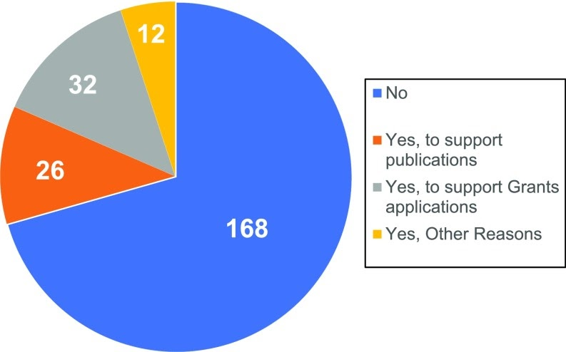

```{r setup, include=FALSE}
knitr::opts_chunk$set(echo = TRUE)
```

# INTRODUCTION

Reproducible research practices include rigorously controlled and documented experiments using validated reagents. These practices are integral to the scientific method, and they enable acquisition of reliable and actionable research results. However, the art and practice of science is affected by challenges that go beyond the inherent complexity of the biology being explored. The pressures to publish, the focus on novel, positive, and impactful results, the use of suboptimal research practices, and the scarcity of research funding likely contribute to unacceptable levels of irreproducible scientific results [@freedman_reproducibility2020_2017].

A recent survey conducted by _Springer_ [-@springer_reality_2016] reported that 90% of participants identified &quot;more robust experimental design&quot; as one of several key improvements needed for the conduct of better science, in addition to &quot;better statistics&quot; and &quot;better mentorship.&quot; More recently, _Nature_ [-@nature_nature_2018] published the survey data [include narrative describing plot results]

[FIXME Insert Plots and narratives here]

A manifesto for reproducible science made several recommendations and called attention to initiatives such as the Transparency and Openness Promotion guidelines created by the [Center for Open Science](https://www.cos.io/) to improve research planning and reporting [@munafo_manifesto_2017], which was supported by over 5000 journals and research organizations. On June 9, 2015, the U.S. National Institutes of Health (NIH) published a notice [^1] that identified four areas for improvement that are now required to be addressed by scientists in grant applications, as follows:

1. scientific premise forming the basis of the proposed research

2. rigorous experimental design for robust and unbiased results

3. consideration of sex and other relevant biologic variables

4. authentication of key biologic and chemical resources

The Association of Biomolecular Resource Facilities (ABRF) Committee on Core Rigor and Reproducibility (CCoRRe) recently conducted a survey to assess how shared resource facilities are currently assisting investigators with their need to demonstrate transparency and rigor in their research. In addition, the survey captured information from the shared resource personnel related to the challenges they face and the resources they need to support scientific transparency, rigor, and reproducibility.

# MATERIALS AND METHODS

## Survey Overview

The CCoRRe committee developed an 18-question online survey and shared it using [SurveyMonkey](https://surveymonkey.com/r/CCoRRe_2017). The survey was announced on the ABRF listservs and blogs and was open from February to April 2017. All survey participants remained anonymous.

## Data Analysis

The survey contained both multiple-choice and open-ended text questions. The open-ended text questions were categorized and coded following an inductive coding approach with at least two independent coders.

# RESULTS AND DISCUSSION

## Survey Demographics

A total of 243 individuals from 21 countries completed this section. The majority of the survey participants are core facility directors or managers (69%) and work in an academic setting (72%) in the United States (79%).

## Current Landscape for Rigor and Transparency in Represented Shared Resources

When asked how knowledgeable participants were with respect to the NIH research rigor initiatives, 47% stated they were very familiar, whereas the rest were equally either somewhat familiar or completely unaware of such guidelines (Fig. 1).

{#id .class width=50% height=50%}


Time pressures associated with publishing and grant preparation were frequently identified as risks to research rigor. Many respondents noted that inadequate standardization of protocols and procedures across the research life cycle, from study planning through data analysis and reporting, contributes to variable research quality. As previously reported, [@bustin_reproducibility_2014; @freedman_reproducibility2020_2017] respondents indicated that experimental design deficiencies (involving sample size, quality control, and replication) and cost considerations could generate risks to research rigor and transparency.

Table 1 represents the perceived challenges faced in promoting best practices for rigorous research in core settings. Issues associated with sample quality or quantity top the list. 


TABLE 1 - Major challenges to rigor observed in shared resources

| **Category** | **N** |
| --- | --- |
| Poor sample quality from users/sample variability/limited biological material | 51 |
| Lack of well-trained principle investigators and lab members/Poor oversight | 45 |
| Poor experimental design: Lack of sufficient replicates/inadequate sample size/lack of adequate controls | 43 |
| Inadequate standardization of protocols or guidelines, and data analysis | 43 |
| Cost and time | 39 |
| Failure to leverage the core&#39;s expertise/following the core&#39;s advice/no consulting beforehand | 23 |
| Inadequate documentation of experiments/data management | 19 |
| Instruments: maintenance, upgrades, changes | 15 |
| Responses that could not be assigned to a category | 11 |

Just over 70% of respondents noted that their clients do not routinely request specific information (documentation or practice statements) related to the procedures used by the cores to foster rigorous and reproducible research (Fig. 2).

{#id .class width=50% height=50%}


The apparent lack of core engagement at the institutional level does not necessarily reflect a general lack of rigor in the daily operations of the cores. Indeed, 213 out of 216 who participated in this section of the survey selected at least one tool that they currently use to support R&amp;R in their daily core operations and almost 75% indicated at least four more tools. With that regard, it is important to highlight:

* At least 170 (∼80%) respondents use documentation, in the form of quality control and standard operation procedures (SOPs) to support R&amp;R practices.
* The incorporation of an instrumentation management plan, was not as highly utilized (56%).
* Oversight of data analyses and double-checking results were some of the least widely used ones (26%).

A second set of multiple-choice questions asked participants to select the new tools they think would enhance or facilitate the implementation of R&amp;R best practices within their core operation (Fig. 3).

{#id .class width=60% height=80%}

## Core Implementation of Research Best Practices

Optimal research core services require a full commitment to rigorous methods as an obligation and not as a choice. However, more than half of the participants identified lack of funding and technical staff training as primary deterrents to the implementation and maintenance of R&amp;R initiatives. This illustrates the difficulties that fee-for-service core facilities face when considering the costs associated with establishing new standardized procedures, methods, or technologies, or improving documentation, transparency, and quality control.

## Strategies for Improving R&amp;R in Core Operation

Participants were asked to suggest solutions to mitigate or eliminate challenges and provide a clear path to improved R&amp;R in cores. Some of the responders did emphasize the need for the development of universal guidelines and SOPs that would facilitate the consistent adoption across a technology or application and would incentivize investigators to comply with such published R&amp;R guidelines.

About 40% proposed that funding mechanisms should be available to cores from either discretionary institutional funds or federal agencies to promote and support R&amp;R initiatives. It is clear that survey respondents believe that it is important to identify funding mechanisms to help core service providers become more visible as scientific experts, partners, and educators with the ability to directly influence research quality.

About one quarter of respondents noted that a radical cultural change at the highest institutional levels is necessary to support and foster research rigor and transparency. Research institutions, journals, and funding agencies must be willing to establish clear requirements as well as mandate and &quot;provide incentives to support and monitor research rigor throughout the research life cycle.&quot; These &quot;cultural&quot; observations related to research culture and incentives were frequently noted in previously published reviews of the research reproducibility issue [@baker_1500_2016; @freedman_reproducibility2020_2017].

# CONCLUSIONS

Scientific shared resources support research laboratories to generate critical data across many disciplines. Core personnel maintain considerable expertise that is important for the quality of their work and for sharing with research scientists in their important role as research mentors. They ensure continuous improvement through professional and educational development and through their systematic approach to research methods.

# REFERENCES {-}


[^1]: Through these four elements, the NIH intends to &quot;enhance the reproducibility of research findings through increased scientific rigor and transparency.&quot; ([_https://ori.hhs.gov/images/ddblock/ORI%20Data%20Graphs%202006-2015.pdf_](https://ori.hhs.gov/images/ddblock/ORI%20Data%20Graphs%202006-2015.pdf))
